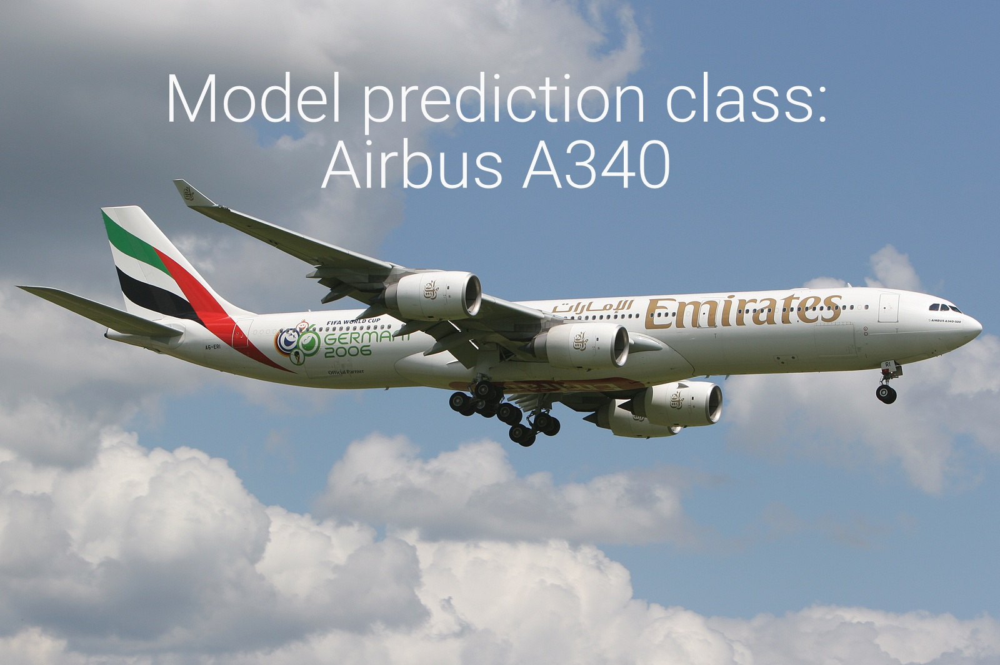

# Deep-Learning-Image-Recognition-Project

In this work, deep learning image recognition techniques are used to identify aircraft model types from aircraft images. 

## Dataset
The dataset is made available on Kaggle: https://www.kaggle.com/datasets/curiousstay/aircraft-dataset
The provided dataset consists of 3 subsets: 
- 1800 training images
- 900 validation images
- 900 testing images
Each subset consists of nine classes with balanced representation

## Summary of results
- The model shows good performance with 92% accuracy on both validation and test sets
- The accuracy of predicting individual classes varies in the range of 84-97%

## Presentation
You can watch the presentation of the project results here:
https://www.youtube.com/watch?v=IGT-SU5wNrg
